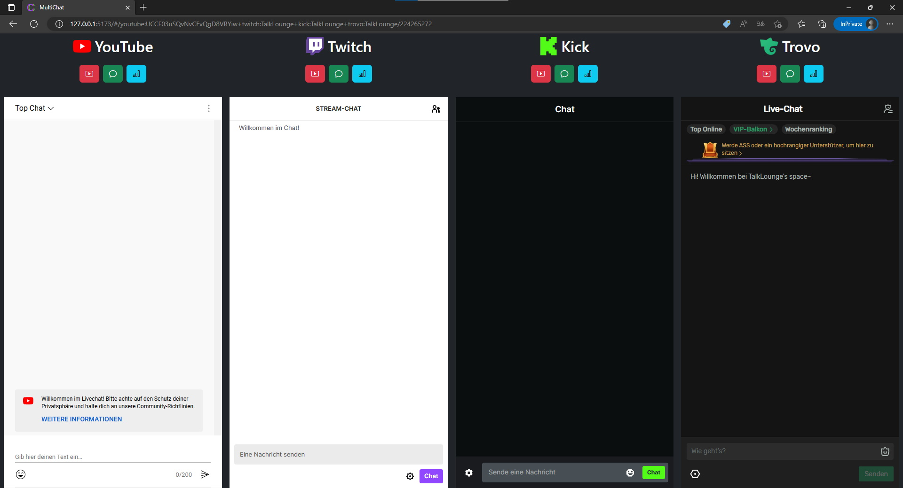

# MultiChat: Different Chats at once

See multiple chats combined on one website. You are a stream viewer and want to see chats from different streamers at the same time OR You are a streamer and restream to different platforms at the same time? Use MultiChat

[Open MultiChat Demo](https://talklounge.github.io/multichat/#/youtube:UCCF03uSQvNvCEvQgD8VRYiw+twitch:TalkLounge+kick:TalkLounge+trovo:TalkLounge/224265272)
<br>
<br>


## Table of Contents
- [MultiChat: Different Chats at once](#multichat-different-chats-at-once)
  - [Table of Contents](#table-of-contents)
  - [Public Instances](#public-instances)
  - [URL Parameters](#url-parameters)
  - [Setup](#setup)
    - [Requirements](#requirements)
    - [Installation](#installation)
    - [Development](#development)
    - [Production](#production)
  - [License](#license)

## Public Instances
* [Official MultiChat Instance](https://talklounge.github.io/multichat/)

## URL Parameters

Parameters consist of Key and Value in the format Key:Value, separated from other Parameters with +
<br>
Example URL: https://talklounge.github.io/multichat/#/youtube:UCCF03uSQvNvCEvQgD8VRYiw+twitch:TalkLounge+disable-dashboard

Key               | Value        | Example Key:Value                | Info
----------------- | ------------ | -------------------------------- | ---
youtube           | Channel-ID   | youtube:UCCF03uSQvNvCEvQgD8VRYiw | Channel-ID can be found [here](https://www.youtube.com/account_advanced)
twitch            | Channel Name | twitch:TalkLounge
kick              | Channel Name | kick:TalkLounge
trovo             | Channel Name | trovo:TalkLounge/224265272
disable-dashboard |              |                                  | Disables Dashboard Button

## Setup
### Requirements
* [Node.js](https://nodejs.org/)

### Installation
```
git clone https://github.com/TalkLounge/multichat
cd multichat
npm install
```

### Development
```
npm run dev
```

### Production
```
npm run build
```

## License
[MIT](LICENSE)